# ohpm-repository-manager    

## 系统平台要求    
ohpm支持在Windows、MacOS、Linux操作系统下使用。

ohpm通过软链接或符号链接的方式构建依赖关系。不同操作系统需满足如下要求：

- Windows：

工程代码文件所在文件系统类型需为NTFS（Windows系统下默认为NTFS）；
使用源码依赖时，依赖的源码模块与被依赖的源码模块需要在同一个盘符下，不允许配置跨盘符依赖。
- MacOS：

工程代码文件所在文件系统类型需为APFS（macOS系统下默认为APFS）。

如在macOS上挂载了其他不支持符号链接的文件系统（如FAT32或exFAT），则无法在其上创建符号链接。

- Linux：

EXT4、Btrfs、XFS、ZFS等常见Linux文件系统类型均满足要求。

部分较老或简单的文件系统（不支持符号链接），可能存在无法在其上创建或正确解析软链接的情况。

## 常用命令        
```dotnetcli
ohpm config
ohpm help
ohpm info
ohpm init
ohpm install
ohpm list
ohpm publish
ohpm uninstall
ohpm prepublish
ohpm unpublish
ohpm update
ohpm root
ohpm version
ohpm cache clean
ohpm run
ohpm --version
ohpm ping
ohpm clean
ohpm dist-tags
ohpm convert
```


## [私仓搭建](https://developer.huawei.com/consumer/cn/doc/harmonyos-guides-V5/ide-ohpm-repo-0000001749596668-V5)    


```bash
npm install
```

```bash
export PATH=$PATH:./bin
```


```bash
➜  ohpm-repository-manager git:(master) ✗ ohpm-repo -v
5.0.4
```

```bash
➜  ohpm-repository-manager git:(master) ✗ ohpm-repo install
[2024-08-08T16:08:31.500] [WARN] default - "listen" protocol is set to 'http' in "config.yaml" file, which is insecure, advise to use the more secure 'https' protocol instead.
[2024-08-08T16:08:31.517] [DEBUG] default - begin to create new key files.
[2024-08-08T16:08:31.535] [INFO] default - initialize encryption component successfully.
[2024-08-08T16:08:31.536] [INFO] default - initialize "file database" successfully.
[2024-08-08T16:08:31.537] [DEBUG] default - initialize uplinkStorage successfully.
[2024-08-08T16:08:31.542] [INFO] default - initialize "file storage" successfully.
[2024-08-08T16:08:31.544] [DEBUG] default - table "group" is not exist, "group" table has been merged into "group_member" table, the current time is "Thu Aug 08 2024 16:08:31 GMT+0800 (中国标准时间)".
[2024-08-08T16:08:31.550] [INFO] default - insert repo success: repo's id is a9c5e43bf5a140359d1ac99536e0d09a.
[2024-08-08T16:08:31.550] [INFO] console - install successfully.
[2024-08-08T16:08:31.557] [DEBUG] default - current system is "darwin" and configPath is ".zshrc".
[2024-08-08T16:08:31.570] [INFO] default - set "deploy_root" environment variables successfully: "OHPM_REPO_DEPLOY_ROOT = /Users/rockhu/ohpm-repo".
[2024-08-08T16:08:31.571] [INFO] console - to make the environment variables of "deploy_root" take effect, please run the refresh command: "source ~/.zshrc " or ". ~/.zshrc".
```

```bash
➜  ohpm-repository-manager git:(master) ✗ source ~/.zshrc
➜  ohpm-repository-manager git:(master) ✗ echo $OHPM_REPO_DEPLOY_ROOT
/Users/rockhu/ohpm-repo
```


```bash
hsbcnetmobile@Qianwens-MacBook-Pro ohpm-repository-manager % ohpm-repo start
[2024-08-09T16:21:52.655] [INFO] default - config file path: "/Users/hsbcnetmobile/ohpm-repo/conf/config.yaml".
[2024-08-09T16:21:52.661] [INFO] default - initialize "file database" successfully.
[2024-08-09T16:21:52.662] [INFO] default - initialize "file storage" successfully.
[2024-08-09T16:21:52.663] [DEBUG] default - initialize uplinkStorage successfully.
[2024-08-09T16:21:52.724] [INFO] console - https address - localhost:8088 - ohpm-repo/5.0.4.
[2024-08-09T16:25:48.154] [INFO] default - 24c834c8c7484c9ba075c0d2ebc7ba3b login success unlock user.
```

### [config.yaml  配置文件](https://developer.huawei.com/consumer/cn/doc/harmonyos-guides-V5/ide-ohpm-repo-configuration-0000001796516529-V5)

### Access Token    

- 只读token: MTlmYzZmMDVjMzY5NDVmNDg0ODBkZWYyMDhmMTkxODM=
- 读写token: ZjIzMmY1ZWYwMzM0NDk3ZDkyYzZmMmZmMzg1MTUzODI=


1、 AccessToken作用：增加客户端认证方式，ohpm客户端使用AccessToken认证时可省去输入密码的步骤。  
2、 AccessToken生成：AccessToken只在生成时完整显示一次并自动复制到剪切板中，后续只显示脱敏后token，每种类型最多生成10条token。  
3、 AccessToken类型：只读token只可访问除上架、下架包之外的接口，读写token可访问全部接口。   
4、 AccessToken使用：   
4-1、 在ohpm客户端的配置文件.ohpmrc中新增一行'//<ip>:<port>/repos/ohpm/:_auth=<token>'。    
4-2、 '//<ip>:<port>/repos/ohpm/'是客户端publis_registry去除协议名的部分url,'<token>'是生成的token。    
4-3、 使用ohpm客户端执行publish命令。   

## schemas  

```mermaid
---
title: ohpm schema
---
erDiagram
    download_package {

    }
    adminauditlog {

    }
    cachedata{

    }
    dependency{

    }
    deployedinstance{

    }
    downloadfailure{

    }
    groupmember{

    }
    loginfailure{

    }
    loginstatus{

    }
    packagemanifest{

    }
    packagemetadata{

    }
    publickey{

    }
    repo {
        varchar(128) id PK
        varchar(32) name
        varchar(1024) description
        varchar(32) uplink
    }
    uplink{

    }
    uplinkproxy{

    }
    user{
        varchar(64) id
        varchar(32) name
        varchar(256) password
        varchar(64) salt
        tinyint role
        varchar(64) publishId
    }
    validation_config{

    }
    access_token{
        varchar(64) id
        varchar(256) token
        tinyint type
        varchar(64) userId
    }
    dist_tags{

    }
```




```bash

```